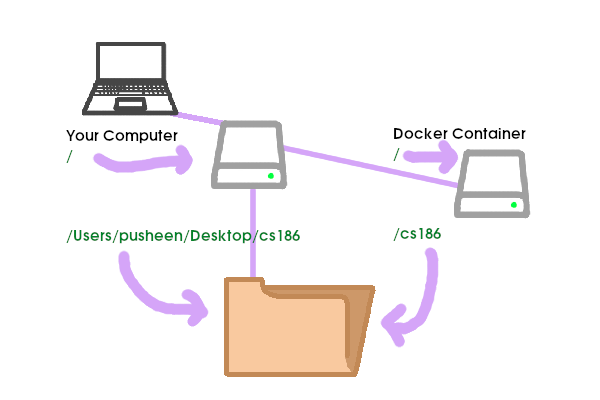

# Homework 0: Setup

This homework is due: **Monday, 1/27/2020, 11:59 PM**.

## Overview

This document should help you set up the environment needed to do
assignments in CS 186.

In order to ensure that your homework solutions are
compatible with the CS186 grading infrastructure, we need to enable you to use
the same software environment that we use for grading.

To that end, we require that homeworks are implemented to execute correctly inside a [docker
container](https://www.docker.com/resources/what-container), for which we
are providing an image. (Note on terminology: a Docker image is a
static object; a Docker container is a running instance of an image.) You will be able to
run this image on Mac, Windows, or Linux computers. The image itself is an Ubuntu Linux environment
with a bash shell. We assume you know the basics of bash and UNIX commands.

**Note: we will not offer leniency in cases where your code fails to compile
or provides a different output when our autograder runs it. It is your responsibility
to make sure everything works as expected in the Docker container.**

## Prerequisites

No lectures are required to work through this homework.

## Installing Docker

The class docker image is called `cs186/environment`.

Before you can use it, you need to install Docker Community Edition ("CE") on your machine.
Most recent laptops should support Docker CE.

- To install Docker CE on Mac or Windows, open the
[Docker getting started page](https://www.docker.com/get-started),
stay on the "Developer" tab, and click the button on the right to download the
installer for your OS. Follow all the instructions included.
- To install Docker CE on Linux, open the [Docker
docs](https://docs.docker.com/install/#server), and click the appropriate link
to find instructions for your Linux distro.

### Additional Notes for Windows Users

1. Not all editions of Windows support the default `Docker for Windows` distribution. To quote from [the Docker docs](https://docs.docker.com/docker-for-windows/install/):

> System Requirements:
>
> Windows 10 64bit: Pro, Enterprise or Education (Build 15063 or later).
> Virtualization is enabled in BIOS. Typically, virtualization is enabled by default. This is different from having Hyper-V enabled. For more detail see Virtualization must be enabled in Troubleshooting.
> CPU SLAT-capable feature.
> At least 4GB of RAM.

2. If you are running another version of Windows, you should be able to get Docker running by downloading [Docker Toolbox](https://docs.docker.com/toolbox/overview/). (Alternatively, if you'd like to upgrade your computer, [UC Berkeley students can install Windows 10 Education for free](https://software.berkeley.edu/microsoft-os)).

3. When we refer to a "terminal" here, it can be
a traditional `Command Prompt`, or `PowerShell`.  However,
interactive docker terminals do not work in `PowerShell ISE`, only
in `PowerShell`.

4. If you are a Windows
Linux Subsystem user (you would know if you are), then there are
various blog posts  [like this one](https://nickjanetakis.com/blog/setting-up-docker-for-windows-and-wsl-to-work-flawlessly)  that will
show you how to set WSL to play nicely with Docker for Windows.

5. You need to run Docker from a Windows account with Administrator privileges.

## Getting the class docker image

The next step is to get the class docker image. To do this,
*get on a good internet connection*, open a
terminal on your computer and run

```bash
docker pull cs186/environment
```

This will download the class image onto your computer. When it
completes, try the following to make sure everything is working:

```bash
docker run cs186/environment echo "hello from cs186"
```

That should print `hello from cs186` on your terminal. It did this by
running the `echo` shell command inside a `cs186/environment` docker
container.

If you are curious to learn more about using Docker, there is [a nice
tutorial online](https://docker-curriculum.com/).

## Sharing your computer's drive with Docker containers

An important thing to realize about Docker is that the container has its own
temporary filesystem, which is deleted when the container is terminated, and is
not accessible from outside the container. That means that **you must not store
your files inside the Docker container's filesystem: they will be deleted when
the container is terminated!**

Instead, you will store your files in your own computer's "local" drive, and *mount* a directory from your local drive within Docker. Mounted volumes in Docker exist outside the Docker container, and hence are not reset when Docker exits.

You can think of this as: a directory exists on your hard drive, with your CS186
code. On your computer, perhaps this is located at
`/Users/pusheen/Desktop/cs186` - in other words, on your computer, the path
`/Users/pusheen/Desktop/cs186` points to the directory. Inside your containter,
the `/cs186` path points to the same directory. Since the two paths
(`/Users/pusheen/Desktop/cs186` on your computer and `/cs186` in the container)
point to the exact same directory, any changes you make from either side will be
visible to the other side.



### Configuring support for shared drives

You may need to configure your Docker installation to share local drives, depending on your OS. Set this up now.

- **Linux**: you can skip this section -- nothing for you to worry about!
- **Mac**: be aware that you can only share directories under `/Users/`, `/Volumes/`, `/private` and `/tmp/` by default. If that's inconvenient for you, this is [configurable](https://docs.docker.com/docker-for-mac/osxfs/#namespaces).
- **Windows (Docker for Windows)**: To configure Docker to share local drives, follow the instructions [here](https://docs.docker.com/docker-for-windows/#shared-drives). The pathname you will need to use in the `docker run -v` command will need to include a root-level directory name corresponding to the Windows drive letter, and UNIX-style forward slashes. E.g. for the Windows directory `C:\\Users\myid` you would use `docker run -v /c/Users/myid`.
- **Windows (Docker Toolbox)**: be aware that you can only share data within `C:\Users` by default. If the `C:\Users` directory is inconvenient for you, there are [workarounds](http://support.divio.com/local-development/docker/how-to-use-a-directory-outside-cusers-with-docker-toolbox-on-windowsdocker-for-windows) you can try at your own risk. **Also:** the pathname you will need to use in the `docker run -v` command will start with `//c/Users/`. Note the leading double-forward-slash, which is different than Docker for Windows!

### Mounting your shared drive
Your homework files should live on your machine, *not within a Docker container directory!*.

First, **on your local machine** (not in Docker), create a cs186 directory
somewhere, and create a file or directory inside (anything -- all that matters
is that the directory is not empty).

Then, to expose this directory from your machine's filesystem to
your docker container, use the `-v` flag as follows:

```bash
docker run -v "<pathname-to-directory-on-your-machine>:/cs186" -it cs186/environment /bin/bash
```

For example, if the directory you created was `/Users/pusheen/Desktop/cs186`,
then you would run:

```bash
docker run -v "/Users/pusheen/Desktop/cs186:/cs186" -it cs186/environment /bin/bash
```

(Remember: if you're running Docker Toolbox on Windows, `<pathname-to-directory-on-your-machine>` should start with `//c/Users/`)

This mounts your chosen directory to appear inside the Docker container at `/cs186`.

When you get a prompt from docker, simply `cd` to that directory and you should see your local files.

    ubuntu@95b2c8583144:/$ cd /cs186
    ubuntu@95b2c8583144:/cs186$ ls
    <your files listed here>
    ubuntu@95b2c8583144:/cs186$ exit

The `ubuntu@95b2c8583144` (hex digits will be different) tells you that you are
currently *inside* the docker container; typing `exit` will leave the docker
container.

Now you can edit those files within docker *and any changes you make in that directory subtree will
persist across docker invocations* because the files are stored on your machine's filesystem, and not inside the docker container.

If you do _not_ see anything in the directory (and the directory is not blank on
your machine), double check that you typed the local path in correctly. **You
must use the full path to your directory (starting with `/`, not a relative
path)**.

Once you have verified that your directory was mounted correctly, run the
following command:

```bash
docker run --name cs186 -v "<pathname-to-directory-on-your-machine>:/cs186" -it cs186/environment /bin/bash
```

and then exit from the container. This names the container `cs186`, so that you
can start it up without having to fetch maven dependencies every time you work
on a CS 186 homework. If you get an error like `Conflict. The container name
"/cs186" is already in use by container`, run `docker container rm cs186` and
try again.

You can now start your container whenever you want by running:

```bash
docker start -ai cs186
```

### Backing up and versioning your work

We ***very strongly*** encourage you to plan to back up your files using a system
that keeps multiple versions. *You would be crazy not to have a plan for this! We will
not be helping you manage backups, this is your responsibility!*

The hacker's option here is to [learn `git`](http://git-scm.com/book/en/v1/Getting-Started) well enough to manager your own repository.

However, since we are not working in teams this semester, it may be sufficient for your
purposes to use an automatic desktop filesync service like Box, OneDrive or Dropbox.
UC Berkeley students have access to free Box.com accounts as documented [here](https://bconnected.berkeley.edu/collaboration-services/box).
There may be some hiccups making sure that your sync software works with Docker shared drives;
for Box users we recommend using the older [Box Sync](https://community.box.com/t5/Using-Box-Sync/Installing-Box-Sync/ta-p/85) instead of the newer Box Drive application.

**Whatever backup scheme you use, make sure that your files are not publicly visible online. For example, GitHub users should make sure their repos are private.**

### Using Your Favorite Desktop Tools

Because your files live on your machine's filesystem (in `<pathname-to-directory-on-your-machine>`),
you can use your favorite editor or other desktop tools to modify those files.
Any changes you save to those files on your machine will be instantly reflected in Docker.
As a result, you can think of the Docker container as a place to build and run your code, and not a place to *edit* your code!

**Windows users:** you might need to be aware that Windows convention (inherited from DOS) ends lines of text differently than UNIX/Mac convention
(see [this blog post](https://blog.codinghorror.com/the-great-newline-schism/) for fun history).
This could make your code look odd inside the docker image and not run properly.
If you run into this problem, you may need to configure your editor to generate UNIX-style newlines.

## `git` and GitHub

`git` is a *version control* system, that helps developers like you
track different versions of your code, synchronize them across
different machines, and collaborate with others.

[GitHub](https://github.com) is a site which supports this system,
hosting it as a service.

We will only be using git and GitHub to pass out homework assignments
in this course. If you don't know much about git, that isn't a
problem: you will *need* to use it only in very simple ways that we will
show you in order to keep up with class assignments.

Your class docker container includes git already, so you do not need
to install it on your machine separately if you do not want to.
If you'd like to use git for managing your own code versioning, there are many guides to using git online --
[this](http://git-scm.com/book/en/v1/Getting-Started) is a good one.

## Fetching the released code

All assignments in CS 186 will be passed out via GitHub. Please check Piazza to keep up-to-date on changes to assignments.

You should now follow the instructions in the [Fetching the released code section of
the MOOCbase README](README.md#fetching-the-released-code) to get the skeleton code for
MOOCbase, which most of the homeworks will be building on (HW1 is the sole
exception -- it is on SQL, and will not be using this repo, but this homework and all the remaining homeworks after will
involve writing Java to add functionality to MOOCbase).

When you exit Docker, you should find the checked-out files on your machine in the
directory `<pathname-to-directory-on-your-machine>` that you used in your `docker run` command.

## Getting your environment set up

This is a good time to go through [Setting up your local development
environment](README.md#setting-up-your-local-development-environment) and
[Running tests](README.md#running-tests).

To build and test your code in the container, run the following inside the repo
directory:

```bash
mvn clean test -D HW=0
```

Make sure that everything compiles. There should be 1 failure and 1 test run.

## Welcome to CS186!

For this homework, you will need to make a small change to one file.

Open up `src/main/java/edu/berkeley/cs186/database/databox/StringDataBox.java`.
It's okay if you do not understand most of the code right now.

The `toString` method currently looks like:
```java
    @Override
    public String toString() {
        return "Welcome to CS186 (original string: " + s + ")";
    }
```

Change the method to return only the string (`s`).

After this, you should now be passing all the tests in `database.databox.TestWelcome`.

## Submitting the Assignment

See [the main readme](README.md#submitting-homeworks) for submission instructions. The
homework number for this homework is hw0.

You should make sure that all code you modify belongs to files with HW0 todo comments in them.
A full list of files that you may modify follows:

- databox/StringDataBox.java

## Grading

- 100% of your grade will be made up of tests released to you (the tests that we
  provided in `database.databox.TestWelcome`) and completion of the submission
  form on edX.

