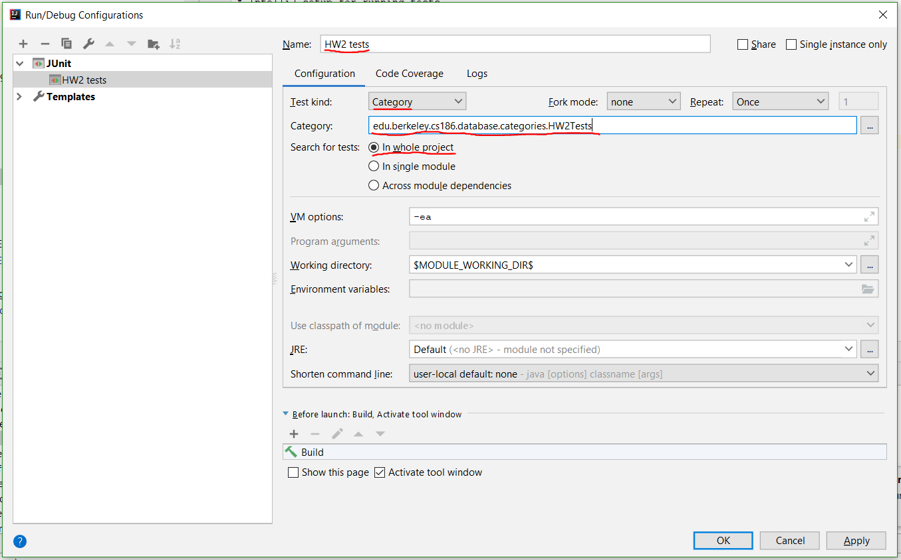

# IntelliJ setup for running tests

This document will help you set up IntelliJ for running a homework's tests
(making it run all the tests that `mvn test -DHW=X` would run).

1. Open up Run/Debug Configurations with Run > Edit Configurations.
2. Click the + button in the top left to create a new configuration, and choose JUnit from
   the dropdown. This should get you the following unnamed configuration:
   
3. Fill in the fields as listed below, then press OK.
   
   - Name: HW2 tests (or whichever homework you're setting up)
   - Test kind: Category
   - Category: edu.berkeley.cs186.database.categories.HW2Tests (or the category corresponding to the homework you're setting up)
   - Search for tests: In whole project
4. You should now see HW2 tests in the dropdown in the top right. You can run/debug this configuration to run all the HW2 tests.
